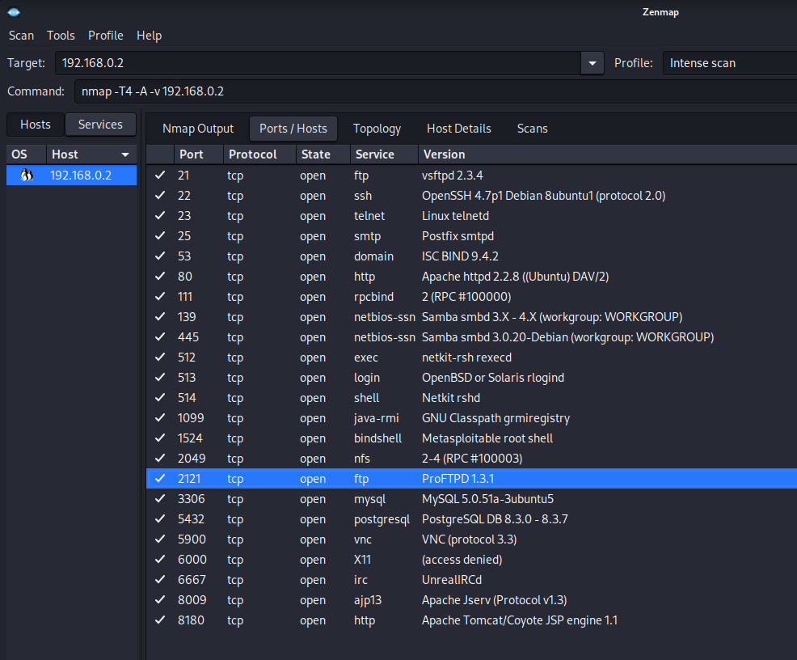
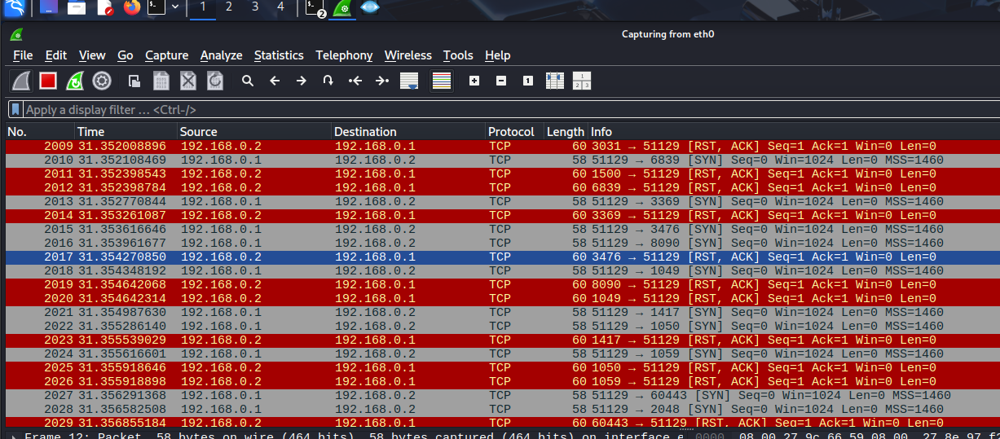
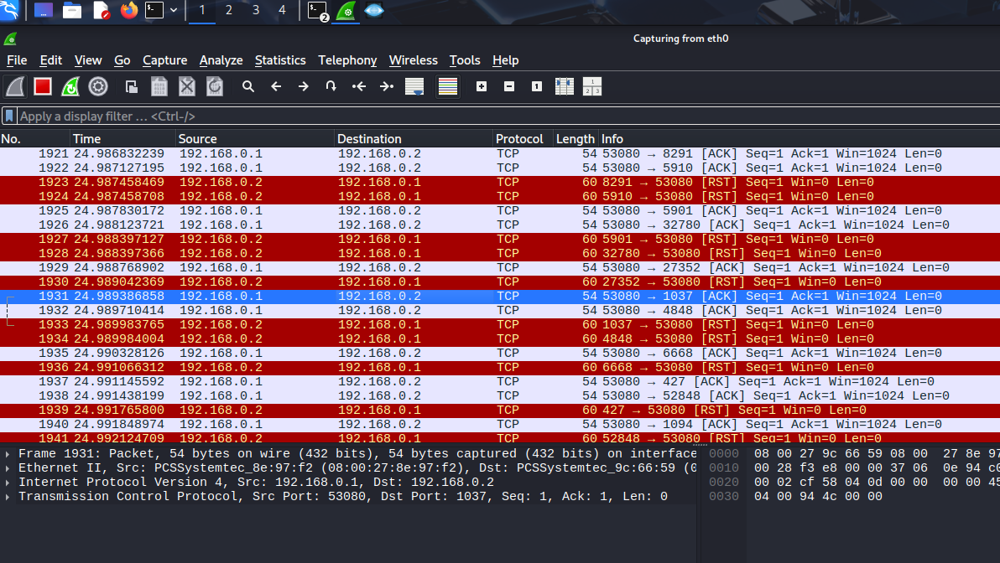
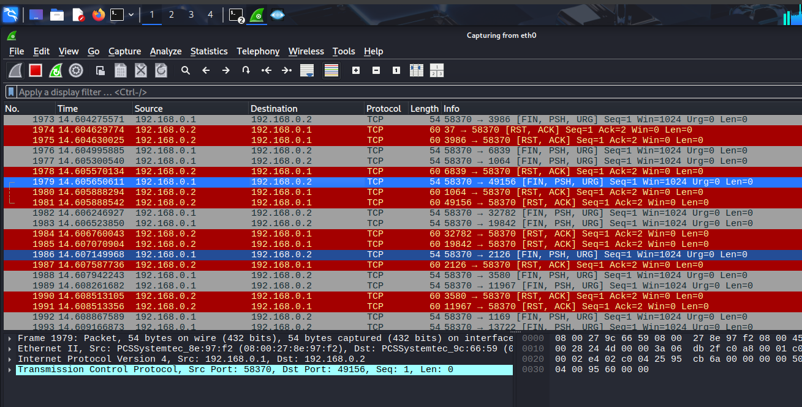
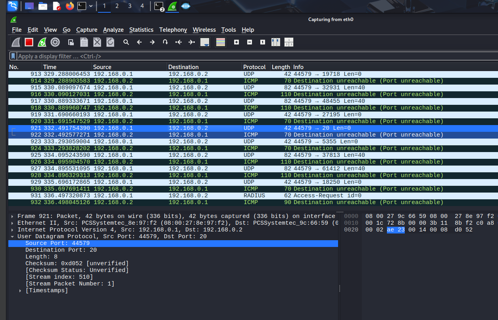

# Домашнее задание к занятию «Уязвимости и атаки на информационные системы»

### Инструкция по выполнению домашнего задания

1. Сделайте fork [репозитория c шаблоном решения](https://github.com/netology-code/sys-pattern-homework) к себе в Github и переименуйте его по названию или номеру занятия, например, https://github.com/имя-вашего-репозитория/gitlab-hw или https://github.com/имя-вашего-репозитория/8-03-hw).
2. Выполните клонирование этого репозитория к себе на ПК с помощью команды `git clone`.
3. Выполните домашнее задание и заполните у себя локально этот файл README.md:
   - впишите вверху название занятия и ваши фамилию и имя;
   - в каждом задании добавьте решение в требуемом виде: текст/код/скриншоты/ссылка;
   - для корректного добавления скриншотов воспользуйтесь инструкцией [«Как вставить скриншот в шаблон с решением»](https://github.com/netology-code/sys-pattern-homework/blob/main/screen-instruction.md);
   - при оформлении используйте возможности языка разметки md. Коротко об этом можно посмотреть в [инструкции по MarkDown](https://github.com/netology-code/sys-pattern-homework/blob/main/md-instruction.md).
4. После завершения работы над домашним заданием сделайте коммит (`git commit -m "comment"`) и отправьте его на Github (`git push origin`).
5. Для проверки домашнего задания преподавателем в личном кабинете прикрепите и отправьте ссылку на решение в виде md-файла в вашем Github.
6. Любые вопросы задавайте в чате учебной группы и/или в разделе «Вопросы по заданию» в личном кабинете.

Желаем успехов в выполнении домашнего задания.

------

### Задание 1

Скачайте и установите виртуальную машину Metasploitable: https://sourceforge.net/projects/metasploitable/.

Это типовая ОС для экспериментов в области информационной безопасности, с которой следует начать при анализе уязвимостей.

Просканируйте эту виртуальную машину, используя **nmap**.

Попробуйте найти уязвимости, которым подвержена эта виртуальная машина.

Сами уязвимости можно поискать на сайте https://www.exploit-db.com/.

Для этого нужно в поиске ввести название сетевой службы, обнаруженной на атакуемой машине, и выбрать подходящие по версии уязвимости.

Ответьте на следующие вопросы:

- Какие сетевые службы в ней разрешены?
- Какие уязвимости были вами обнаружены? (список со ссылками: достаточно трёх уязвимостей)
  
*Приведите ответ в свободной форме.*  

- vsftpd 2.3.4 - Backdoor Command Execution
https://www.exploit-db.com/exploits/49757

- Apache < 2.2.34 / < 2.4.27 - OPTIONS Memory Leak
https://www.exploit-db.com/exploits/42745

- PostgreSQL 8.2/8.3/8.4 - UDF for Command Execution
https://www.exploit-db.com/exploits/7855

### Задание 2

Проведите сканирование Metasploitable в режимах SYN, FIN, Xmas, UDP.

Запишите сеансы сканирования в Wireshark.

Ответьте на следующие вопросы:

- Чем отличаются эти режимы сканирования с точки зрения сетевого трафика?
- Как отвечает сервер?

*Приведите ответ в свободной форме.*

Nmap посылает SYN пакет и для хоста это выглядит как будто с ним хотят установить реальное соединение. Если приходит ответ SYN/ACK - значит порт открыт, а если RST - значит закрыт.

Nmap посылает FIN-пакет и из за того, что соединение с хостом не было установлено он отвечает RST-пакетом для сброса соединения, сообщая о своем существовании.

При Xmas устанавливаются FIN, PSH и URG флаги. Если в ответ приходит RST пакет, то порт считается закрытым, отсутствие ответа означает, что порт открыт.

UDP сканирование работает путем посылки пустого (без данных) UDP заголовка на каждый целевой порт. Если в ответ приходит ICMP ошибка о недостижимости порта, значит порт закрыт.